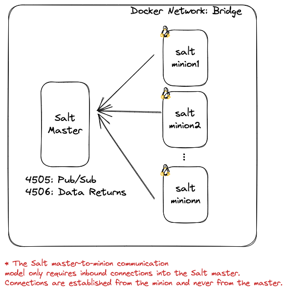

# Salt Lab 

This is a simple lab to test salt commands, features, templates etc. 




This lab basically follows the next posts : 
- https://docs.saltproject.io/salt/install-guide/en/latest/topics/configure-master-minion.html#configure-master-minion
- https://docs.saltproject.io/salt/install-guide/en/latest/topics/configure-master-minion.html#configure-master-minion


## Run the Lab 

In order to run this lab you will need to have the following components installed : 
 * docker
 * docker-compose 
 * Taskgo ([optional](https://taskfile.dev/installation/)). 

If you are using Taskgo you can simply run the following commands to create the lab that will create a salt-master box  and a salt-minion box.

## Using runme : 

```sh
runme
```

## Using Taskfiles : 

```sh {name=start}
task -l 
task start-lab  
```
If you want to scale the minion machines just run : 

```sh {name=scale}
task scale-minion -- 6 # To run 7 salt minion host.
```
Now we are ready to start launching salt commands. 

```sh {name=connect}
task sconnect-master    # This will give you a bash shell in the salt master box
```

## Using Docker Compose : 

```sh
docker-compose up -d 
docker-compose up -d --scale salt-minion=4
docker-compose exec salt-master bash
```

## Recommended Readings : 

- https://docs.saltproject.io/salt/install-guide/en/latest/topics/before-you-start/check-network-ports.html

- https://docs.saltproject.io/en/master/topics/tutorials/walkthrough.html
- https://docs.saltproject.io/en/master/py-modindex.html

